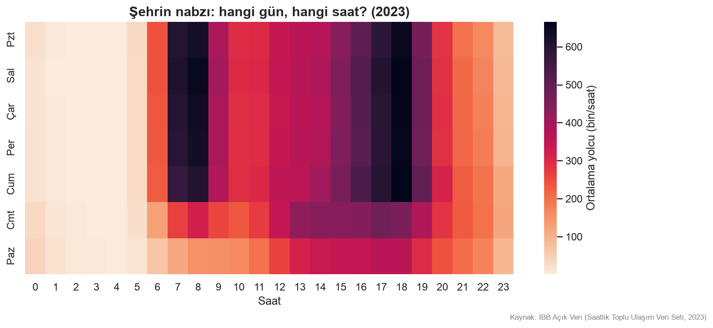
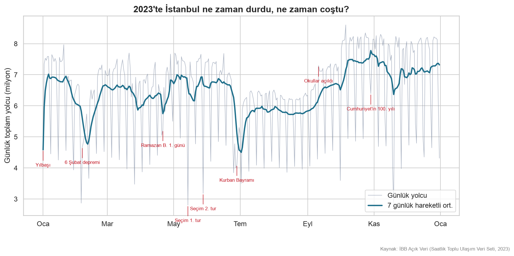
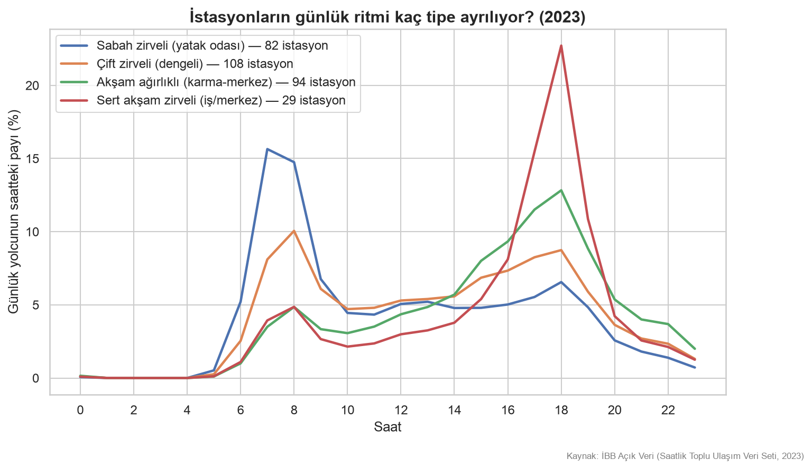

# Gece Haritası — İstanbul Saat Kaçta Nerede Yaşıyor?

İBB Açık Veri Portalı'nın **Saatlik Toplu Ulaşım Veri Seti** ile İstanbul'un
saatlik nabzını çıkaran bir veri analizi projesi. 2023'ün 12 ayı, **~190 milyon
satır** ham CSV, DuckDB ile işlendi; şehrin ne zaman uyandığı, hangi ilçenin
gece yaşadığı ve hangi günlerin "normal" olmadığı gerçek veriyle gösterildi.

> **Tek cümlelik özet:** İBB'nin milyonlarca satırlık gerçek açık verisini
> DuckDB ile işledim, window functions ile analiz ettim, İstanbul'un saatlik
> yaşam ritmini çıkarıp görselleştirdim.

## Bulgular

### İstanbul hafta içi iki kez patlar, hafta sonu tek tepelidir


Hafta içi 07-08 (sabah zirvesi ~630 bin yolcu/saat) ve 17-18 (akşam zirvesi
~660 bin) olmak üzere iki tepe var; akşam zirvesi sabahtan daha yüksek.
Hafta sonu ise şehir yavaş uyanıyor ve 13:00'ten sonra platoya oturuyor.
Şehrin kontağı 05:00'te çevriliyor: 04→05 arası yolcu **19 katına** çıkıyor
(ilk seferler), 05→06 arası **7 kat daha** (`sql/03_saatlik_degisim.sql`, `LAG`).



### 2023'ün anomalileri: deprem, seçim, bayramlar, lodos ve 100. yıl


Her gün, aynı haftanın günü popülasyonuyla karşılaştırıldı (z-skoru).
Öne çıkanlar:

- **En derin düşüşler** Kurban Bayramı arifesi (27 Haziran, z=-3.6) ve
  **18 Kasım lodos fırtınası** (z=-3.2; vapur seferleri iptal edilmişti)
- **6 Şubat deprem haftası** boyunca şehir sessizleşti (5 Şubat'taki kar
  yağışıyla birleşik bir hafta: z=-2.1 … -3.0)
- **En yüksek pozitif anomali Cumhuriyet'in 100. yılı** (29 Ekim, z=+3.1) —
  kutlamalar şehri sokağa döktü
- Seçim günleri (14 ve 28 Mayıs) belirgin negatif



### Gecenin başkenti Beyoğlu, sürprizi Arnavutköy


Raylı sistem istasyonlarında gece (23:00–05:00) yolcu payı: **Beyoğlu ‰52**
ile açık ara önde — Taksim/İstiklal gece ekonomisinin veriye yansıması.
İkinci sıradaki Arnavutköy (‰43) eğlence değil **havalimanı**: M11 metrosu
gece uçuşlarının yolcusunu taşıyor. Mevsimsel not: gece endeksinin yıl
zirvesi **Nisan (‰26.5)** — Ramazan gecelerinin etkisi
(`sql/06_mevsimsel_ritim.sql`).

### İstasyonlar 4 ritim tipine ayrılıyor



313 raylı istasyonun hafta içi saatlik profili k-means ile kümelendi:
**sabah zirveliler** (yatak odası mahalleler: sabah evden çıkılan yer),
**sert akşam zirveliler** (iş merkezleri: akşam işten dönülen yer),
akşam ağırlıklı karma bölgeler ve çift zirveli dengeli istasyonlar.
Bir istasyonun grafiği, çevresinin ne işe yaradığını söylüyor.

### İnteraktif: ilçe ilçe saatlik nabız

`ciktilar/haritalar/ilce_saatlik_nabiz_2023.html` — saat kaydıracıyla 15 büyük ilçenin
raylı sistem yoğunluğunu izleyebilirsiniz (plotly, tarayıcıda açın).

## Veri

- Kaynak: [İBB Açık Veri — Saatlik Toplu Ulaşım Veri Seti](https://data.ibb.gov.tr/dataset/hourly-public-transport-data-set) (BELBİM A.Ş.)
- Dönem: **2023'ün 12 ayı** (~19 GB CSV, ~190M satır → ZSTD Parquet'te ~1 GB)
- Veri repoya dahil değildir (`data/` gitignore'da). Portaldan aylık CSV'leri
  indirip `veri/ham/hourly_transportation_YYYYMM.csv` adıyla koyun.
- **Dikkat:** portaldaki bazı dosyalar eksiktir (ör. Ağustos–Aralık 2024).
  Her dosyayı kullanmadan önce doğrulayın — bu projede 2023 seçilmesinin
  nedeni budur. Kolon anlamları ve tuzaklar: [`veri/VERI_SOZLUGU.md`](veri/VERI_SOZLUGU.md)

## Kurulum ve çalıştırma

```bash
python3 -m venv venv && source venv/bin/activate
pip install -r requirements.txt

# 1) İndirilen her CSV'yi doğrula (eksik gün/saat, şema kayması)
python scriptler/validate_csv.py veri/ham/hourly_transportation_2023*.csv

# 2) CSV → Parquet (ZSTD, ~%95 küçülme; eksik/bozuk aylar otomatik reddedilir)
python kaynak/ingest.py

# 3) Bir yılın tüm grafiklerini üret → ciktilar/grafikler/<yıl>/
python scriptler/make_figures.py 2023
```

### Başka bir yılı işlemek

Pipeline yıl-parametriktir: o yılın aylık CSV'lerini indirip aynı üç adımı
çalıştırmak yeterli. Portal durumu (Temmuz 2026 itibarıyla):

| Yıl | Durum |
|-----|-------|
| 2022 | 12 ay sağlam görünüyor → tam yıl ✅ |
| 2023 | 12 ay doğrulandı ✅ (bu repodaki analiz) |
| 2024 | Ocak–Temmuz sağlam; Ağustos+ bozuk → kısmi yıl |
| 2021 | Ekim dosyası bozuk → 11 ay |
| 2020 | Pandemi yılı; dosyalar küçük ama muhtemelen gerçek (şehir durmuştu). `ingest`/`validate` eşiğini `--esik` ile düşürmek gerekebilir |

Yeni yıl işlerken o yılın özel günlerini `scriptler/make_figures.py` içindeki
`OZEL_GUNLER` sözlüğüne ekleyin — anomali grafiği etiketlerini oradan alır
(eksikse tarih yazar, grafik yine üretilir).

## Repo yapısı

```
├── defterler/01_otopsi.ipynb   # veri keşfi: kirlilik, tuzaklar, kararlar
├── veri/VERI_SOZLUGU.md        # kolon sözlüğü + bilinen veri tuzakları
├── veri/esleme/                # M7 istasyon→ilçe eşlemesi (kaynakta eksik)
├── sql/                        # numaralı DuckDB sorguları; her dosyanın
│                               #   başında hangi soruya cevap verdiği yazar
├── kaynak/                        # ingest (CSV→Parquet), db (view katmanı), viz
├── scriptler/                    # validate_csv.py, make_figures.py
└── ciktilar/                    # PNG grafikler + interaktif HTML
```

## Teknik notlar

- **DuckDB-first:** 19 GB ham CSV hiçbir zaman pandas'a yüklenmedi; filtre ve
  aggregate DuckDB'de, görselleştirme pandas + matplotlib/seaborn/plotly'de.
- **Window functions:** zirve saat (`ROW_NUMBER`), saatlik değişim (`LAG`),
  7 günlük hareketli ortalama (`ROWS BETWEEN 6 PRECEDING`), yıl ortalamasına
  göre sapma (`AVG() OVER ()`), koşullu toplamlar (`FILTER`), `QUALIFY`.
- **Veri kalitesi:** portal dosyaları körü körüne kullanılmaz;
  `scriptler/validate_csv.py` gün×saat kapsamını ve şemayı denetler. `town`
  kolonu otobüste garaj bölgesi olduğu için ilçe analizleri raylı sistemle
  sınırlandı (detay: veri sözlüğü).
