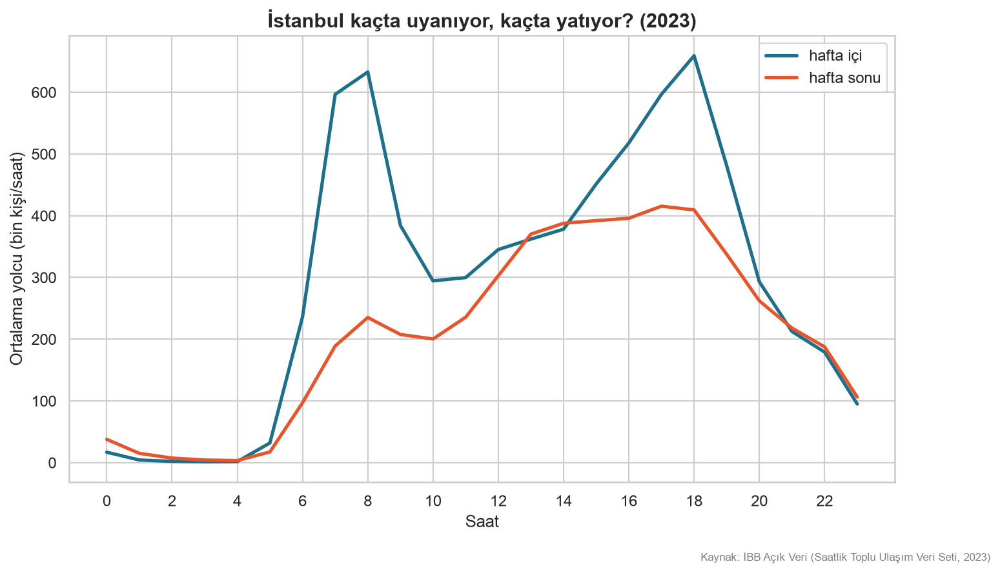
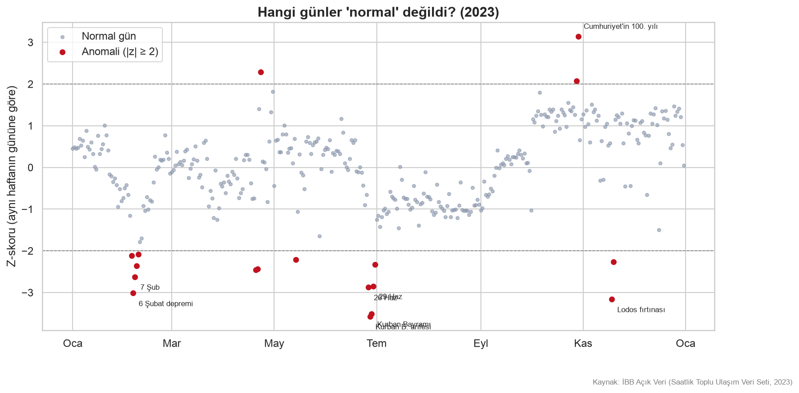
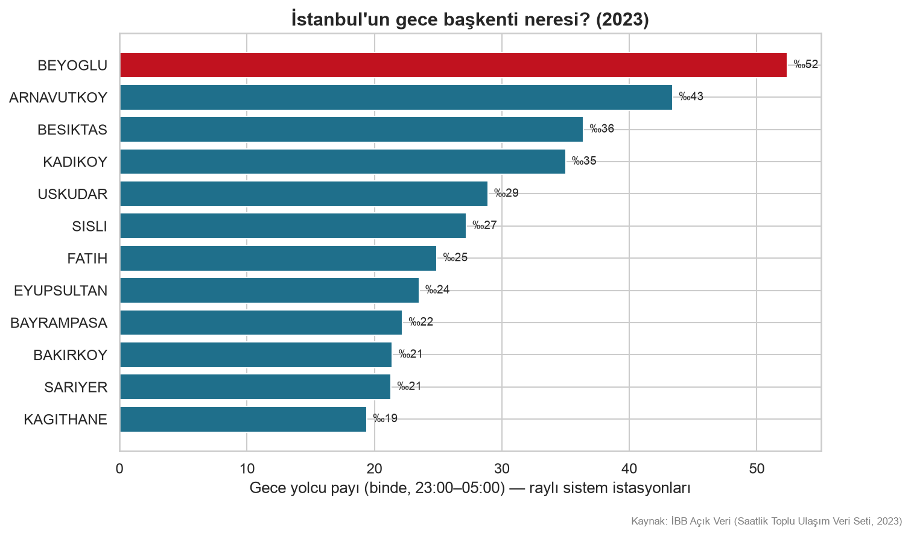

# İstanbul Analiz 


İBB'nin saatlik toplu ulaşım verisiyle İstanbul'un günlük ritmi.
2022 başından 2024 Temmuz'una kadar tüm yolculuk kayıtları DuckDB ve
Python ile işlendi.


## Öne çıkan bulgular

- Şehir sabah 5'te ilk seferlerle bir anda uyanıyor; hafta içi sabah ve akşam olmak üzere iki kez zirve yapıyor, hafta sonu öğleden sonra tek bir platoya oturuyor.
- Gecenin başkenti Beyoğlu. İkinci sıradaki Arnavutköy'ün sırrı eğlence değil, havalimanı metrosunun gece uçuş yolcuları.
- Metro açılışları veriden okunuyor: havalimanı hattı açılınca Arnavutköy gece ligine girdi, M7 uzantısı açılınca Beşiktaş'ın gece payı sıçradı.
- Şehri durduran günler veride tek tek görünüyor: 6 Şubat depremi, kar fırtınaları, seçim günleri, bayram arifeleri, lodos. Şehri sokağa döken en büyük gün ise Cumhuriyet'in 100. yılı.
- "Emekli saati" gerçek: ücretsiz kart sahipleri sabah koşuşturmasına katılmıyor, öğle saatlerinde kendi ritmini yaşıyor. Öğrenci kartlarının profili yaz tatilinde bambaşka bir şekle bürünüyor.
- Ramazan geceleri şehir belirgin biçimde canlanıyor; sahur saatlerinde ise hareket yok — sahur evde geçiyor.
- Pazartesi sendromu veride yok: hafta içi günler birbirinin kopyası. Gece yarısının en kalabalık anı ise Pazar'a devreden Cumartesi gecesi.
- Raylı sistem istasyonları birkaç karakteristik ritim tipine ayrılıyor: sabah yoğun "yatak odası" duraklar, akşam yoğun iş merkezleri ve karma bölgeler.

## Grafikler


*İstanbul kaçta uyanıyor, kaçta yatıyor?*


*Hangi günler "normal" değildi?*


*İlçelerin gece yolcu payı*


*Üç yılda gece hayatı — metro açılışlarının izi*


*Kim hangi saatte yolda?*


*Ramazan'ın saatlik imzası*

İnteraktif haritalar `ciktilar/haritalar/` altında (indirip tarayıcıda açın).
Tüm yılların grafikleri `ciktilar/grafikler/` altında.

## Veri

- Kaynak: [İBB Açık Veri — Saatlik Toplu Ulaşım Veri Seti](https://data.ibb.gov.tr/dataset/hourly-public-transport-data-set)
- Veri repoda yok: aylık CSV'leri portaldan indirip
  `veri/ham/hourly_transportation_YYYYMM.csv` adıyla koyun.
- Portaldaki bazı dosyalar eksik olabiliyor; her dosya kullanılmadan önce
  doğrulanır. Kolonların anlamı: [`veri/VERI_SOZLUGU.md`](veri/VERI_SOZLUGU.md)

## Çalıştırma

```bash
python3 -m venv venv && source venv/bin/activate
pip install -r requirements.txt

python scriptler/validate_csv.py veri/ham/*.csv   # doğrula
python kaynak/ingest.py                            # CSV → Parquet
python scriptler/make_figures.py 2023             # yıl grafikleri
python scriptler/make_gece_haritasi.py 2023       # ilçe haritası
python scriptler/compare_years.py                 # yıllar arası kıyas
python scriptler/ozel_analizler.py                # kart tipi, Ramazan, günler
python scriptler/make_gif.py 2023                 # animasyonlu harita
```

